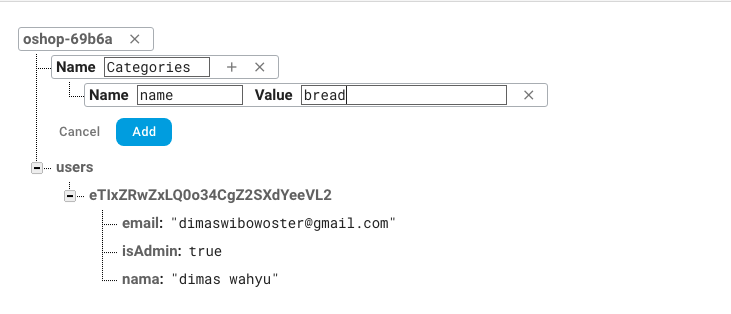
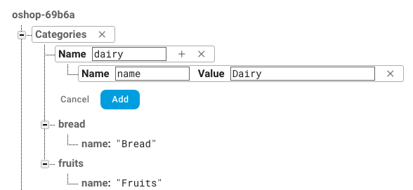
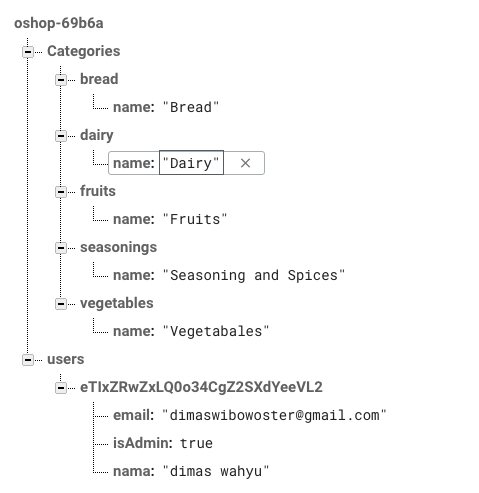

# Kemampuan Akhir Yang Direncanakan

- Peserta mampu menampilkan list dropdown dari firebase

# Percobaan 19 menampilkan list dropdown dari firebase
- buka halaman firebase anda dan tambahkan beberapa **add child** pada project anda seperti pada gambar berikut




- sehingga hasil akhirnya seperti pada gambar berikut 


- buatlah services baru dengan nama **category**

```
ng g s category
```

- tambakan **CategoryService** pada **app.module.ts**

```
  providers: [
    AuthService,
    AuthGuard,
    UserService,
    AdminAuthGuard,
    CategoryService
  ],
```
- buka file **category.service.ts** tambahkan code berikut

```
import { Injectable } from '@angular/core';
import { AngularFireDatabase } from 'angularfire2/database';
import { Observable } from 'rxjs';
import { map } from 'rxjs/operators';
 
@Injectable({
  providedIn: 'root'
})
export class CategoryService {
 
  categories: Observable<any[]>;
 
  constructor(private db: AngularFireDatabase) { }
 
getCategories () {
    return this.db.list('/Categories', ref => ref.orderByChild('name')).snapshotChanges()
    .pipe(
      map(actions =>
        actions.map(a => ({ key: a.key, ...a.payload.val() }))
      )
    );
  }
}
```

- buka file **product-form.component.ts** tambahkan code berikut

```
import { Component, OnInit } from '@angular/core';
import { CategoryService } from 'src/app/category.service';

@Component({
  selector: 'app-product-form',
  templateUrl: './product-form.component.html',
  styleUrls: ['./product-form.component.css']
})
export class ProductFormComponent implements OnInit {

  categories$;

  constructor(categoryService:CategoryService) {
    this.categories$=categoryService.getCategories();
   }

  ngOnInit() {
  }

}

```

- tambahkan code pada **product-form.component.ts** 

```

<form>
  <div class="form-group">
    <label for="title">Title</label>
    <input type="text" id="title" class="form-control">
  </div>

  <div class="form-group">
  <label for="price">Price</label>
  <div class="input-group mb-3">
      <div class="input-group-prepend">
        <span class="input-group-text">$</span>
      </div>
      <input type="text" class="form-control">
    </div>
  </div>
  
  <div class="form-group">
    <label for="category">Category</label>
    <select type="text" id="category" class="form-control">
      <option value=""></option>
      <!-- tambahkan code berikut -->
      <option *ngFor="let c of categories$ | async" [value]="c.key">
        {{c.key}}
      </option>
    </select>
  </div>

  <div class="form-group">
    <label for="image-url">Image Url</label>
    <input type="text" id="image-url" class="form-control">
  </div>
  <button class="btn btn-primary">Save</button>
</form>

```

