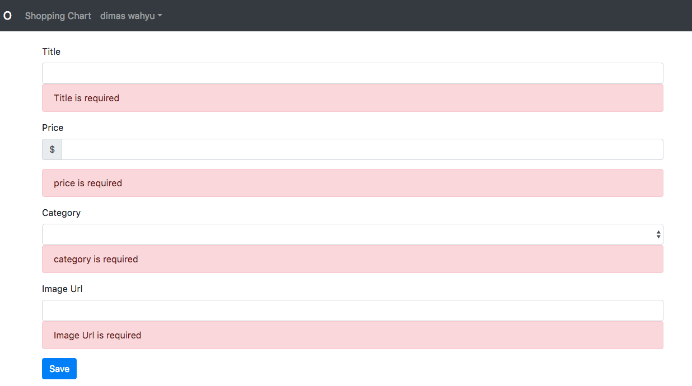

# Kemampuan Akhir Yang Direncanakan

- Peserta mampu menerapkan validasi 

# Percobaan 21  validasi
- buka file **product-form.component.html** modfikasi code  sehingga seperti berikut

```
<form #f="ngForm" (ngSubmit)="save(f.value)"> 
  <div class="form-group">
    <label for="title">Title</label>
    <input #title="ngModel" ngModel name="title" type="text" id="title" class="form-control" required>
    <div class="alert alert-danger" *ngIf="title.touched && title.invalid">
      Title is required
    </div>
  </div>

  <div class="form-group">
  <label for="price">Price</label>
  <div class="input-group mb-3">
      <div class="input-group-prepend">
        <span class="input-group-text">$</span>
      </div>
      <input  #price="ngModel" ngModel name="price" id ="price" type="text" class="form-control" required>
  </div>
  <div class="alert alert-danger" *ngIf="price.touched && price.invalid">
      price is required
    </div>
</div>

  <div class="form-group">
    <label for="category">Category</label>
    <select #category="ngModel" ngModel name="category"  type="text" id="category" class="form-control" required>
      <option value=""></option>
      <!-- tambahkan code berikut -->
      <option *ngFor="let c of categories$ | async" [value]="c.key">
        {{c.key}}
      </option>
    </select>
    <div class="alert alert-danger" *ngIf="category.touched && category.invalid">
        category is required
      </div>
  </div>
  

  <div class="form-group">
    <!-- rubah image-url menjadi imageurl agar memudahkan -->
    <label for="imageurl">Image Url</label>
    <input #imageurl="ngModel"  ngModel name="imageurl"  type="text" id="imageurl" class="form-control" required>
    <div class="alert alert-danger" *ngIf="imageurl.touched && imageurl.invalid">
        Image Url is required
      </div>
  </div> 
  <button class="btn btn-primary">Save</button>
</form>

```
- lakukan uji coba dengan tidak memasukkan inputan, jika berhasil maka tampillan akan seperti pada gambar


