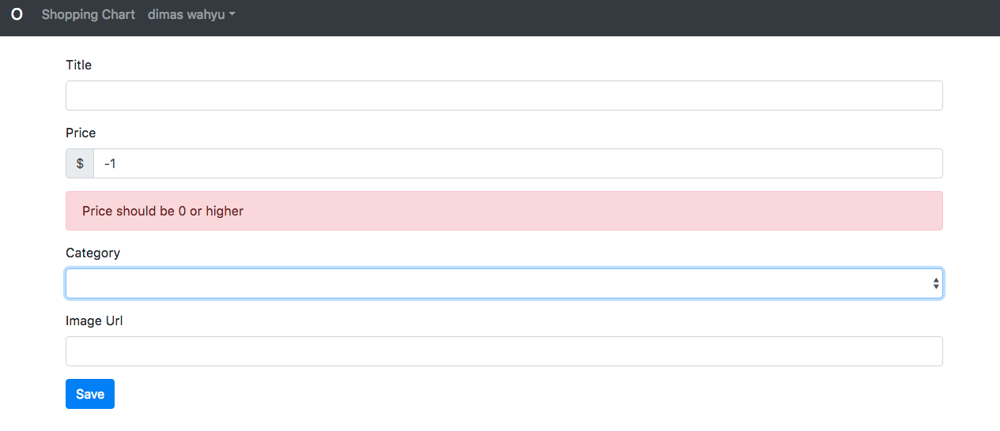
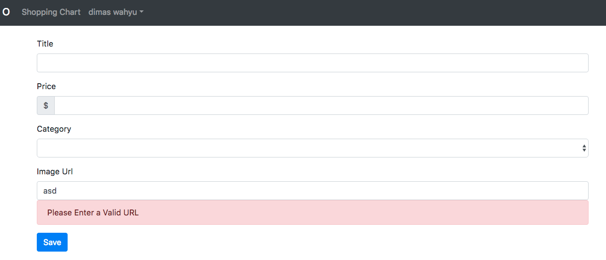

# Kemampuan Akhir Yang Direncanakan

- Peserta mampu menerapkan custom validasi 
- https://www.npmjs.com/package/ng2-validation

# Percobaan 22 Custom validasi  
- install ng2 validation 

```
npm install ng2-validation --save
```

- import pada **app.module.ts** 

```
import { CustomFormsModule} from 'ng2-validation';

```

- tambahkan juga pada **imports** **CustomFormModule**

```
 imports: [
    BrowserModule,
    CustomFormsModule,
    FormsModule,
    AngularFireModule.initializeApp(environment.firebase),
    AngularFireDatabaseModule,
    AngularFireAuthModule,
    NgbModule.forRoot(),
    RouterModule.forRoot(
      [
        {path:'',component:HomeComponent},
        {path:'products',component:ProductsComponent},
        {path:'shopping-chart',component:ShoppingChartComponent},
        {path:'check-out',component:CheckOutComponent, canActivate:[AuthGuard]},
        {path:'order-success',component:OrderSuccessComponent,canActivate:[AuthGuard]},
        {path:'orders',component:MyOrdersComponent,canActivate:[AuthGuard]},
        {path:'login',component:LoginComponent},
        {path:'admin/admin-products',
              component:AdminProductsComponent,
              canActivate:[AuthGuard,AdminAuthGuard]},
        {path:'admin/admin-products/new',
              component:ProductFormComponent,
              canActivate:[AuthGuard,AdminAuthGuard]},
        {path:'admin/admin-orders',
              component:AdminOrdersComponent,
              canActivate:[AuthGuard,AdminAuthGuard]},        
      ]
    )
  ],

```

- buka file **product-from.component.html** dan modifikasi codenya untuk **price** menjadi berikut **kita berikan peringatan jika user memasukkan angka negatif pada inputan price** 

```
  <div class="form-group">
    <label for="price">Price</label>
    <div class="input-group mb-3">
      <div class="input-group-prepend">
        <span class="input-group-text">$</span>
      </div>
      <input
        #price="ngModel"
        ngModel
        name="price"
        id="price"
        type="text"
        class="form-control"
        required
        [min]="0"
      />
    </div>
    <div class="alert alert-danger" *ngIf="price.touched && price.invalid">
      <div *ngIf="price.errors.required">price is required</div>
      <div *ngIf="price.errors.min">Price should be 0 or higher</div>
    </div>
  </div>

```

- jika berhasil maka hasilnya seperti gambar berikut:



- buka file **product-from.component.html** dan modifikasi codenya untuk **image url** menjadi berikut **kita berikan peringatan jika user tidak memasukkan file url yang benar** 

```
 <div class="form-group">
    <!-- rubah image-url menjadi imageurl agar memudahkan -->
    <label for="imageurl">Image Url</label>
    <input
      #imageurl="ngModel"
      ngModel
      name="imageurl"
      type="text"
      id="imageurl"
      class="form-control"
      required url
    />
    <div
      class="alert alert-danger"
      *ngIf="imageurl.touched && imageurl.invalid"
    >
    <div *ngIf="imageurl.errors.required"> Image Url is required</div>
    <div *ngIf="imageurl.errors.url"> Please Enter a Valid URL</div>
    </div>
  </div>
```

- jika berhasil maka tampilannya akan seperti gambar berikut 

