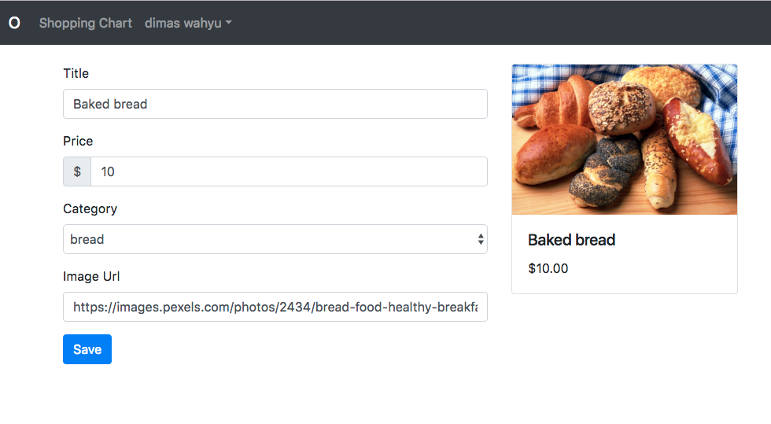

# Kemampuan Akhir Yang Direncanakan

- Peserta mampu menerapkan bootstrap Card
- https://getbootstrap.com/docs/4.0/components/card/#card-layout

# Percobaan 23 Bootstrap Card
- modifikasi code pada file **product-form.component** menjadi **2 div dengan atribut class row col-md-6** pada **row pertama isikan form yang sudah kita buat tadi** sedangkan **row kedua isiakan code card bootstrap** sehingga keseluruhan code seperti berikut :

```
<div class="row">
  <div class="col-md-6">
    <form #f="ngForm" (ngSubmit)="save(f.value)">
      <div class="form-group">
        <label for="title">Title</label>
        <input
          #title="ngModel"
          ngModel
          name="title"
          type="text"
          id="title"
          class="form-control"
          required
        />
        <div class="alert alert-danger" *ngIf="title.touched && title.invalid">
          Title is required
        </div>
      </div>

      <div class="form-group">
        <label for="price">Price</label>
        <div class="input-group mb-3">
          <div class="input-group-prepend">
            <span class="input-group-text">$</span>
          </div>
          <input
            #price="ngModel"
            ngModel
            name="price"
            id="price"
            type="text"
            class="form-control"
            required
            [min]="0"
          />
        </div>
        <div class="alert alert-danger" *ngIf="price.touched && price.invalid">
          <div *ngIf="price.errors.required">price is required</div>
          <div *ngIf="price.errors.min">Price should be 0 or higher</div>
        </div>
      </div>

      <div class="form-group">
        <label for="category">Category</label>
        <select
          #category="ngModel"
          ngModel
          name="category"
          type="text"
          id="category"
          class="form-control"
          required
        >
          <option value=""></option>
          <!-- tambahkan code berikut -->
          <option *ngFor="let c of (categories$ | async)" [value]="c.key">
            {{ c.key }}
          </option>
        </select>
        <div
          class="alert alert-danger"
          *ngIf="category.touched && category.invalid"
        >
          category is required
        </div>
      </div>

      <div class="form-group">
        <!-- rubah image-url menjadi imageurl agar memudahkan -->
        <label for="imageurl">Image Url</label>
        <input
          #imageurl="ngModel"
          ngModel
          name="imageurl"
          type="text"
          id="imageurl"
          class="form-control"
          required
          url
        />
        <div
          class="alert alert-danger"
          *ngIf="imageurl.touched && imageurl.invalid"
        >
          <div *ngIf="imageurl.errors.required">Image Url is required</div>
          <div *ngIf="imageurl.errors.url">Please Enter a Valid URL</div>
        </div>
      </div>
      <button class="btn btn-primary">Save</button>
    </form>
  </div>
  <div class="col-md-6">
    <div class="card" style="width: 18rem;">
      <!-- rubah code  -->
      
      <div class="card-body">
        <h5 class="card-title">{{ title.value }}</h5>
        <p class="card-text">{{ price.value | currency: "USD":true }}</p>
      </div>
    </div>
  </div>
</div>


```


- jika berhasil maka tampilannya akan seperti gambar berikut 



- buka file **products-form.component.ts** modifikasi code menjadi seperti berikut

```
import { Component, OnInit } from '@angular/core';
import { CategoryService } from 'src/app/category.service';
import { ProductService } from 'src/app/product.service';
import { Router } from '@angular/router';

@Component({
  selector: 'app-product-form',
  templateUrl: './product-form.component.html',
  styleUrls: ['./product-form.component.css']
})
export class ProductFormComponent implements OnInit {

  categories$;

  constructor(
    private router:Router,
    private categoryService:CategoryService,
    private productService:ProductService) {
    this.categories$=categoryService.getCategories();
   }

   save(product){
    //  console.log(product);
    this.productService.create(product);
    this.router.navigate(['/admin/admin-products']);
    
   }

  ngOnInit() {
  }

}


```
