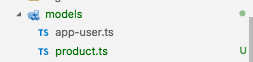

# Kemampuan Akhir Yang Direncanakan

- Peserta mampu menerapkan datatable dalam angular
- https://www.npmjs.com/package/angular-6-datatable 

# Percobaan install datatable

- langkah install datatabel 
```
npm i angular-6-datatable --save
```

- buka file **app.module.ts** tambahkan **import {DataTableModule} from 'angular-6-datatable';** dan tambahkan juga **   DataTableModule,** pada imports

```
import {DataTableModule} from 'angular-6-datatable';

  imports: [
    BrowserModule,
    CustomFormsModule,
    DataTableModule,
    FormsModule,
    AngularFireModule.initializeApp(environment.firebase),
    AngularFireDatabaseModule,
    AngularFireAuthModule,
    NgbModule.forRoot()
```

# Percobaan configurasi datatable

- buka file **admin-products.component.html**

```

```

- buatlah sebuah interface baru pada folder models dan beri nama **product.ts** seperti gambar berikut


