# Laporan JS10
---

#### Praktikum – Bagian 1: Configure the routes
- Buat project baru yang berisi komponen posts (praktikum http service), form-member (soal uts), navbar, not-found, home

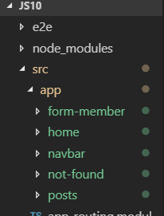

- Buka file app.module.ts. Pastikan komponen pada langkah 1 sudah terdaftar seperti gambar dibawah ini


- Menambahkan module router pada halaman app.module.ts seperti gambar dibawah ini:

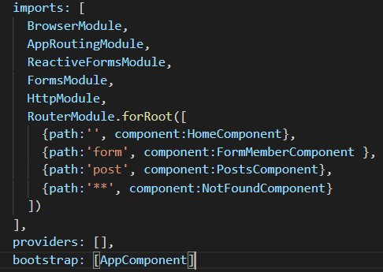

- Buka halaman navbar.component.html dan tambahkan kode dibawah ini:

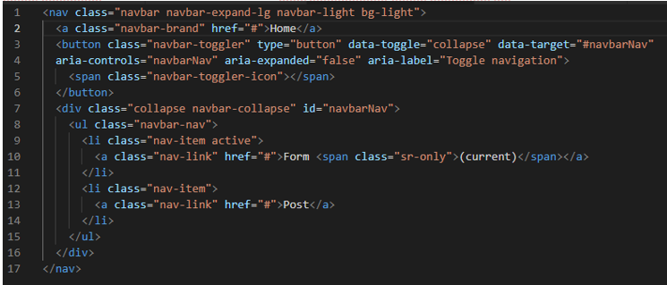

- Buka halaman app.component.html. tambahkan kode dibawah ini:

```
<app-navbar></app-navbar>
```
- Jalankan dan catat hasilnya (soal no. 1)

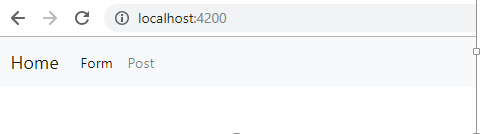

---

#### Praktikum – Bagian 2: Router Outlet
- Buka halaman app.component.html dan rubah menjadi seperti dibawah ini:
```
<app-navbar></app-navbar>
<router-outlet></router-outlet>
```

- Jalankan dan inspect elemen seperti pada gambar dibawah ini (soal no 2)

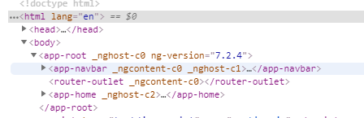

- Jalankan link dibawah ini localhost:4200/form seperti gambar dibawah ini(soal 3):

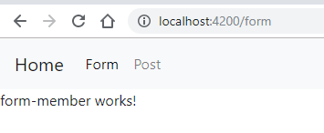

- Jalankan link dibawah ini localhost:4200/form seperti gambar dibawah ini(soal 4):

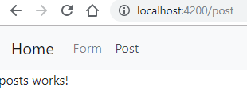

- Jalankan link dibawah ini localhost:4200/form seperti gambar dibawah ini(soal 5):

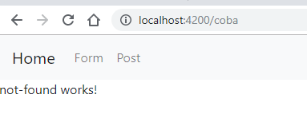

- Simpulkan langkah 3, 4 dan 5 (Soal No. 6) :
  ```
  Setiap mengunjungi link(/form, /post, /coba) maka yang akan tampil yaitu sesuai konfigurasi dari component.html nya, jika kita mengunjungi link tidak dalam konfigurasi maka yang ditampilkan component dari not-found

  ```
---

#### Praktikum – Bagian 3: Add Link
- Buka halaman navbar.component.html. tambahkan link pada href tiap menu seperti gambar dibawah ini:

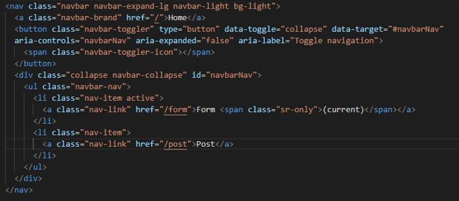

- Jalankan, catat dan berikan penjelasan (Soal No. 7)

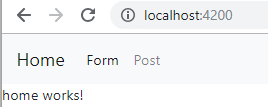

- Modifikasi href menjadi routerLink pada halaman navbar.component.html seperti gambar dibawah ini:


- Jalankan, inspect element, coba link dan cek pada tab network. Catat dan beri penjelasan (Soal No. 8)

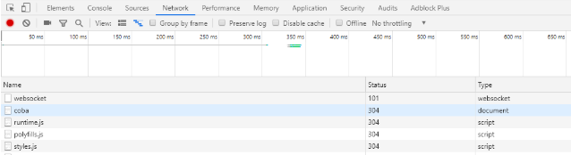

- Modifikasi class li pada halaman navbar.component.html menjadi seperti pada gambar dibawah ini:

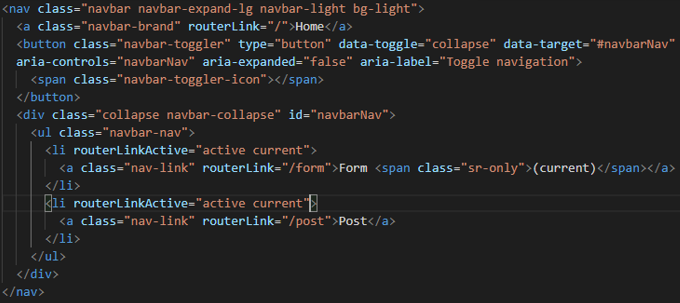

- Jalankan, catat dan beri penjelasan (Soal No. 9)

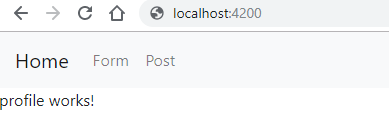

---

#### Praktikum – Bagian 4: Accesing Route Parameter
- Buat komponen baru dengan nama profile dengan perintah ng g c profile

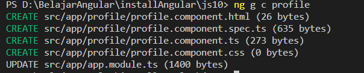

- Buka app.module.ts dan tambahkan route untuk profile seperti gambar dibawah ini: 

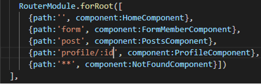

- Modifikasi halaman home.component.html menjadi seperti gambar dibawah ini:

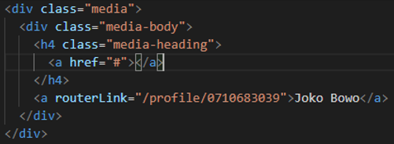

- Modifikasi file profile.component.ts menjadi seperti pada gambar dibawah ini:

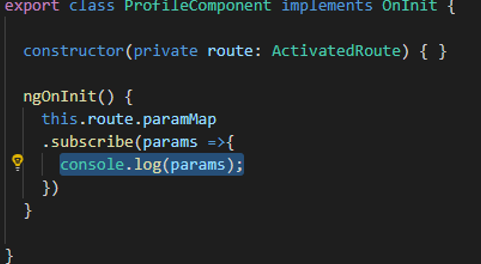

- Jalankan, klik tombol home kemudian kliklink joko bowo kemudia inspect element seperti dibawah ini (soal no 10):

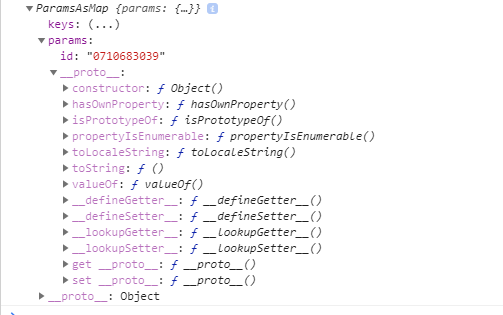

- Modifikasi file profile.component.ts menjadi seperti pada gambar dibawah ini:

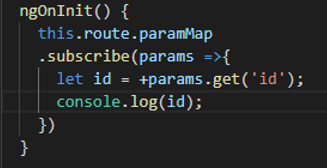

- Jalankan, klik tombol home kemudian klik link joko bowo kemudia inspect element. Catat dan berikan penjelasan (Soaln No. 11)

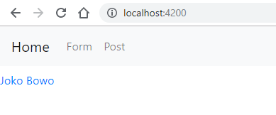

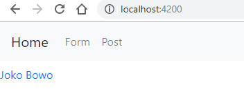


