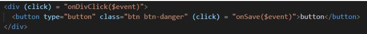

# Laporan JS4
---
#### Praktikum bagian 1
- Membuka file ** course.component.ts ** menambahkan code berikut ini :

```
import { Component, OnInit } from '@angular/core';
import { CoursesService } from '../courses.service';

@Component({
  selector: 'app-courses',
  templateUrl: './courses.component.html',
  styleUrls: ['./courses.component.css']
})
export class CoursesComponent implements OnInit {

  Title = 'Belajar Angular';
  Courses;

  binding = 'property-binding';
  imageUrl = 'http://lorempixel.com/400/200';

  constructor(private service:CoursesService) { 
    this.Courses = service.getCourses;
  }

  ngOnInit() {
  }

}

```

- Membuka file ** course.component.html ** tambahkan code berikut ini :
```
<p>
  {{ Title }}
</p>
<table>
  <thead>
    <th>
      #ID
    </th>
    <th>Course name</th>
  </thead>
  <tbody>
    <tr *ngFor = "let Course of Courses">
    <td>{{ Course.id }}</td>
    <td>{{ Course.name }}</td>
    </tr>
  </tbody>
</table>

<h2>{{ binding }}</h2>
<h2 [textContent]='binding'></h2>


```

- Lalu hasilnya :


---
#### Praktikum bagian 2
- Membuka file **courses.component.ts** tambahkan property colspan dibawah line imageUrl.


- Membuka file **courses.component.html** dan menambahkan berikut ini :


- Lalu muncul error seperti :


- Menambahkan attr pada colspan seperti berikut :


- Setelah di compile maka hasilnya : 


- Selanjutnya menambahkan button pada **courses.component.html** seperti berikut :


- Maka hasilnya seperti berikut :


---
#### Praktikum bagian 3
- Buka file ** courses.component.ts ** kemudian menambah propery ` isActive = true ` setelah line ` colspan = 2;`.

 

- Merubah ` isActive ` menjadi false.

 

---
#### Praktikum bagian 4
- Membuka file ** courses.component.html ** kemudian tambahkan code berikut :

```
<button type = 'button' class = "btn btn-primary" [style.backgroundColor] = "isActive?'blue':'white'" > Tambah </button>

```

---
#### Praktikum bagian 5
- Membuka file ** course.component.ts ** dan buatlah method dengan nama ` onSave() `.
 

- Membuka file ** courses.component.html ** dan menambahkan ` event click `.
 

- Membuka ** file courses.component.ts **  menambahkan parameter ` $event `.
 

- Menammbahkan juga pada ** courses.component.html ** .
```
<div (click) = "onDivClick($event)">
  <button type = "button" class = "btn btn-danger" (click) = "onSave($event)"> Button </button>
</div>
```

- Menjalankan localhost dan inspect element

 

- Membuat method ` onDivClick() ` pada ** courses.component.ts **.
 

- Menambahkan div dan event binding pada div elemen
 

- Menjalankan localhost dan melakukan inspect elemen.
 

- Untuk mengatasi event bubbling maka menambahkan ` $event.stopPropagation ` pada ** courses.component.ts **.

 

- Menjalankan localhost dan melakukan inspect elemen. 
   

---
#### Praktikum bagian 6

- Membuat inputan pada courses.component.html seperti berikut:
```
<input type = "text" (keyup.enter) = "onKeyUp()">

```
- Menambahkan method `onKeyUp`:

 


- Hasilnya:

  

---
#### Praktikum bagian 7
- Menambahkan variabel `#nama` pada courses.component.html :
```
<input type = "text" #nama (keyup.enter) = "onKeyUp(nama.value)">

```

- Menambahkan parameter nama pada method onKeyUp():

 
 

---
#### Praktikum bagian 8
- membuat property baru dengan nama ` nama = 'serildawn'; `.
- menambahkan parameter nama di `onKeyUp` 
```
 <input type="text" [value]="nama" (keyup.enter)="nama = $event.target.value;onKeyUp()"> 

```

- Membuka file **app.module.ts** dan menambahkan formmodule seperti berikut:
 

- Membuka **courses.component.html**, lalu memodifikasi codenya seperti berikut:
 


