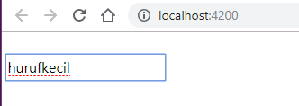

#Laporan JS5
---
####6.1 ngIF
- Membuka **app.component.ts** 

```
import {Component} from '@angular/core';

@Component({
    selector: 'app-root',
    templateUrl: './app.component.html',
    styleUrls: ['./app.component.css']
})

export class AppComponent {
    title = 'belajar-angular';
    courses = [1,2];
}

```

- Membuka file **app.component.html**

```
<div *ngIf="courses.length > 0">
  list of courses
</div>
<div *ngIf="courses.length == 0">
  no courses yet
</div>

```
- Hasilnya:


- Jika array pada **app.component.ts** di kosongkan maka hasilnya:


---

##### *Contoh kedua menggunakan else*

```
<!-- percabangan ke 2 -->
<div *ngIf="courses.length > 0 ; else noCourses">
list of courses
</div>
<ng-template #noCourses> 
no courses yet
</ng-template

```
- jalankan dengan kondisi array kosong pada **app.component**

```
export class AppComponent{
    title = 'belajar-angular';
    courses=[];
}

```

- hasilnya adalah:


- jalankan dengan kondisi array ada isi pada **app.component**

```
export class AppComponent{
    title = 'belajar-angular';
    courses=[1,2];

}
```

- hasilnya adalah:


---
##### *cara ketiga*
- Membuka file **app.component.html**

```
<!-- percobaan ketiga -->
<div *ngIf="courses.length > 0 ; then coursesList else noCourses"></div>
<ng-template #coursesList>
    List of Courses
</ng-template>

<ng-template #noCourses> 
    no courses yet
</ng-template>

```

- Jalankan dengan kondisi array kosong pada **app.component**

```
export class AppComponent{
    title = 'belajar-angular';
    courses=[];
}
```

- Jalankan dengan kondisi array ada isinya **app.component**

```
export class AppComponent{
    title = 'belajar-angular';
    courses=[1,2];

}
```

---
####6.1 Hidden Property
- Membuka **app.component.html**

```
<div hidden> list courses list</div>
<div>no courses yet</div>
```
- Menambahkan properti

```
<div [hidden]="courses.length == 0"> list courses list</div>
<div [hidden]="courses.length > 0">no courses yet</div>

```

---
####6.1 ngSwitchCase
- Membuka file **app.component.html**

```
<ul class="nav nav-pills">
  <li class="nav-item">
    <a 
      (click)="viewMode = 'map'"
      class="nav-link"
      [class.active]="viewMode == 'map'"
      >Map View</a>
  </li>
  <li class="nav-item">
    <a 
     (click)="viewMode = 'list'"
     class="nav-link"
     [class.active]="viewMode == 'list'"
     >list View
  </a>
  </li>
</ul>
<div [ngSwitch]="viewMode">
  <div *ngSwitchCase="'map'">Map View Content</div>
  <div *ngSwitchCase="'list'">List View Content</div>
  <div *ngSwitchDefault>Other</div>
</div>
<router-outlet></router-outlet>

```
- Membuka file **app.component.ts** menambahkan property viewMode 
```
viewMode='map';
```

- Maka hasilnya:


---
####6.1 ngFor
- Membuka **app.component.ts** menambahkan property CoursesFor yang berisikan array 

```
coursesFor=[
    {id:1,name:'courses1'},
    {id:2,name:'courses2'},
    {id:3,name:'courses3'},
    {id:4,name:'courses4'},
    {id:5,name:'courses5'},
  ]
}
```
- Membuka file **app.component.html** menambahkan directive ngFor

```
<ul>
  <li *ngFor="let item of coursesFor ; index as i" >
    {{i}}-{{item.name}}
  </li>
</ul>
```

- Maka hasilnya adalah:


- Kita juga dapat memberi tanda tertentu pada index yang bernilai ganjil dengan menggunakan isEven

```
<ul>
  <li *ngFor="let item of coursesFor ; even as isEven">

    {{item.name}}
    <span *ngIf="isEven">(Even)</span>
  </li>
</ul
```

- Maka hasilnya adalah :


---
####6.1 ngFor dan change Detection 
- Menambahkan button pada **app.component.html**

```
<button (click) = "onAdd()">add</button>

<ul>
  <li *ngFor="let item of coursesFor; even as isEven">
    {{item.name}}
    <span *ngIf="isEven">(even)</span>
  </li>
</ul>
```

- Menambahkan method onAdd()

```
onAdd(){
    this.coursesFor.push({id:6,name:'courses6'});
  }
```

- Maka hasilnya bila di tekan tombol add:


- Menambahkan sebuah method onRemove pada **app.component.ts**

```
onRemove(item) {
    console.log(item);
    let index = this.coursesFor.indexOf(item);
    console.log(index);
    this.coursesFor.splice(index, 1);
  }

```

- Membuka **app.component.html** dan tambahkan sebuah button untuk menghapus
```
<button (click) = "onRemove(item)">remove</button>
```

- Maka hasilnya:


- Menambahkan method onChange() pada app.component.ts
```
 onChange(item) {
    item.name = 'Updated';
  }
```

- Mengganti button remove dengan update pada **app.component.html**
```
<button (click) = "onChange(item)">update</button>
```
- Maka hasilnya :


---
####6.1 ngFor dan trackby
- Membuka file app.component.ts membuat sebuah method dengan nama loadCourses 
```
courseForOne;
  loadCourse(){
    this.courseForOne=[
      {id:1,nama:'courseone1'}, 
      {id:2,nama:'courseone2'},
      {id:3,nama:'courseone3'},
      {id:4,nama:'courseone4'},
      {id:5,nama:'courseone5'},
    ];
  }
```

- Membuka file **app.component.html** dan menambahkan code

```
<button (click)="loadCourse()">Tampil data</button>
<li *ngFor="let itemone of courseForOne">
  {{itemone.nama}}
</li>
```

- Maka hasilnya saat di click:


- Menambahkan TrackBy dengan cara menambahkan pada **app.component.html** pada directive ngFor 

```
<br>
&nbsp; <button (click) = "loadCourse()">Tampilkan data</button>
<li *ngFor="let itemone of courseForOne ; TrackBy:trackCourse">{{itemone.nama}}</li>

```

-  Menambahkan juga sebuah method trackCourse 
```
trackCourse(index,itemone) {
    return itemone ? itemone.id : undefined;
  }
```


---
####6.1 The leading Asterik 
- Menambahkan code pada **app.component.html**

```
<div *ngIf="courses.length > 0">
  list of courses
</div>
```

- Menambahkan `<ng-template>` pada **app.component.html**

```
ng <ng-template [ngIf]="courses.length>0">
<div>
  list of course
</div>
</ng-template>

```

---
####6.1 ngClass 
- Membuat 2 class binding `fa-star` dan `fa-star-o`
- Membuat atrribute directive class untuk fa

---
####6.1 Custom Directive
- Membuat directive dengan nama input-format


- Buka file **app.module.ts** memastikan pada @NgModel terdapat input-format yang sudah di buat


- Buka file **input-format.directive.ts** kemudian menambahkan decorator HostListener

- Buka file **app.component.html** kemudian menambahkan code berikut:

```
<br>
&nbsp;<input type="text" appInputFormat>

<router-outlet></router-outlet>

```
- buka file app.component.html dan tambahkan property binding dengan nama format 
```
&nbsp;<input type="text" appInputFormat [format] = "'lowercase'">
```
- buka file input-format.directive.ts tambahkan decorator input dan modifikasi codenya
- Mengubah menjadi uppercase
```
&nbsp;<input type="text" appInputFormat [format] = "'uppercase'">
```
- Menambahkan decorator input dengan parameter `appInputFormat`
```
  @Input('appInputFormat')format;
```
- Maka hasilnya adalah : 




