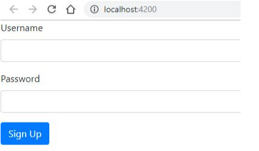

# Laporan JS8
---
#### 8.1 Building a Bootstrap Form
- Membuat component baru dengan nama signup-form dengan perintah **ng g c signup-form**
  
- Memodifikasi **app.component.html** 

```
<app-signup-form></app-signup-form>
```

- Modifikasi file signup-form.component.html 

```
<form>
  <div class="form-group">
    <label for="username">Username</label>
    <input
      id="username"
      type="text"
      class="form-control">
  </div>
  <div class="form-group">
    <label for="password">Password</label>
    <input
      id="password"
      type="text"
      class="form-control">
  </div>
  <button class="btn btn-primary" type="submit">Sign Up</button>
</form>

```
- Hasil dari soal 1 : 

 

---
#### 8.2 Control Programmatically
- Modifikasi file **signup-form.component.ts** seperti dibawah ini:

```

import { Component, OnInit } from '@angular/core';
import {FormGroup, FormControl} from '@angular/forms';

@Component({
  selector: 'app-signup-form',
  templateUrl: './signup-form.component.html',
  styleUrls: ['./signup-form.component.css']
})
export class SignupFormComponent implements OnInit {

  form = new FormGroup({
    username: new FormControl(),
    password: new FormControl()
  })

  constructor() { }

  ngOnInit() {
  }

}

```
- Memodifikasi signup-form.component.html menjadi seperti berikut: 

```
<form [formGroup]="form">
  <div class="form-group">
    <label for="username">Username</label>
    <input
    formControlName="username"
      id="username"
      type="text"
      class="form-control">
  </div>
  <div class="form-group">
    <label for="password">Password</label>
    <input
    formControlName="password"
      id="password"
      type="text"
      class="form-control">
  </div>
  <button class="btn btn-primary" type="submit">Sign Up</button>
</form>

```

- Hasil dari soal 2:

  

- Modifikasi file **app.module.ts** tambahkan kode berikut:
```
import {FormsModule, ReactiveFormsModule} from '@angular/forms';
```

```
 imports: [
    BrowserModule,
    AppRoutingModule,
    FormsModule,
    ReactiveFormsModule
```
- Hasil dari soal 3:

  

---
#### 8.3 Adding Validation 
- Modifikasi signup-form.component.ts menjadi seperti berikut:
```
import { Component, OnInit } from '@angular/core';
import {FormGroup, FormControl, Validators} from '@angular/forms';
```

```
form = new FormGroup({
    username: new FormControl('',Validators.required),
    password: new FormControl('',Validators.required)
  })

```
- Modifikasi **signup-form.component.html** menjadi seperti berikut:

```
formControlName="username"
      id="username"
      type="text"
      class="form-control">
      <div *ngIf="form.get('username').touched && form.get('username').invalid"  class=" alert alert-danger">
        username is required
      </div>

```
- Hasil dari soal 4:

  

- Menambahkan get username pada file **signup-form.component.ts** seperti berikut:

```
getUsername (){
    return this.form.get('username');
  }

```

- Memodifikasi file signup-form.component.html menjadi seperti berikut:

```
<div *ngIf="username.touched && username.invalid"  class= "alert alert-danger">
        Username is required
      </div>

```
- Hasil dari soal 5:

---
#### 8.4 Specific Validation Errors
- Modifikasi **signup-form.component.ts** menjadi seperti berikut:
```
 form = new FormGroup({
    username: new FormControl('',
    [Validators.required, Validators.minLength(5)]),
    password: new FormControl('',Validators.required)
  })
```

- Modifikasi **signup-form.component.html** menjadi seperti berikut:

```
<div *ngIf="username.touched && username.invalid" class="alert alert-danger">
   <div *ngIf="username.errors.required">Username is requied</div>
   <div *ngIf="username.errors.minlength">Username should minimum 5 character</div>
 </div>

```

- Hasil dari soal 6:

 
- Memodifikasi **signup-form.component.html** menjadi seperti berikut:

```
<div *ngIf ="username.errors.minlength">
 Username should minimum {{username.errors.minlength.requiredlength}} characters
</div>

```

---
#### 8.5 Custome Validation
- Buat file baru pada folder signup-form dengan nama username.validators.ts dan isi dengan script sebagai berikut:

```
import {ValidationErrors, AbstractControl} from '@angular/forms';

export class UsernmaeValidators{
    static cannotContainSpace (control: AbstractControl): ValidationErrors | null{
        if((control.value as string).indexOf(' ')>=0)
            return {cannotContainSpace: true};
        return null;
    }
}
```

- Modifikasi signup-form.component.ts menjadi seperti berikut:
```
 form = new FormGroup({
    username: new FormControl('',[
        Validators.required,
        Validators.minLength(5),
        UsernmaeValidators.cannotContainSpace
    ]),
```

- Modifikasi signup-form.component.html menjadi seperti berikut:

```
<div *ngIf="username.errors.cannotContaininSpace">Cannot contain space</div>
```
- Hasil dari soal 8:


---
#### 8.6 Asyncronus Validation
- Modifikas file username.validators.ts seperti berikut:
```
static unique (control: AbstractControl): Promise < ValidationErrors | null > {
        return new Promise((resolve, reject)=> {
            setTimeout(()=>{
                if(control.value === 'polinema')
                resolve({unique: true});
                else resolve(null);
            }, 2000);
        })
    }
```

- Modifikasi **signup-form.component.ts** menjadi seperti berikut:

```
form = new FormGroup({
    username: new FormControl('',
    [Validators.required, Validators.minLength(3),
     UsernameValidators.cannotContainSpace],
     UsernameValidators.shouldBeUnique), 
    password: new FormControl('',Validators.required)
  })
```
- Modifikasi **signup-form.component.html**, tambahkan <div> seperti berikut:

```
<div *ngIf ="username.error.shouldBeUnique">
          Username is already taken 
        </div>

```
- Hasil dari soal 9:

 

---
#### 8.7 Displaying a Loader Image
- Modifikasi **signup-form.component.html**, tambahkan <div> seperti berikut:
```
<div *ngIf="username.pending">Checking for uniquiness....</div>
```
- Hasil dari soal 10:

  


---
#### 8.8 Validating Form on Submit
- Modifikasi signup-form.component.ts, dengan menambahkan method login() seperti berikut:
```
login(){
    this.form.setErrors({
      invalidLogin:true
    });
  }
```

- Modifikasi **signup-form.component.html** seperti berikut:

```
<form [formGroup]="form" (ngSubmit)="login()">
  <div *ngIf="form.errors" class= "alert alert-danger">
    The username and password is invalid 
  </div>

```
- Hasil dari soal 11.

  
