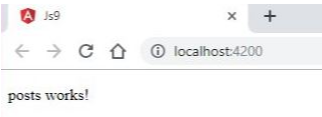

#Laporan JS9
---

#### Praktikum – Bagian 1: JSONPlaceHolder
- Mengunjungi alamat berikut : http://jsonplaceholder.typicode.com/
- Maka hasilnya:

 

---

#### Praktikum - Bagian 2 : Getting Data
- Membuat component baru dengan nama posts dengan perintah `ng g c posts`

 

- Untuk menggunakan HTTPService, kita perlu melakukan import HttpModule pada **app.module.ts.**

 

*Jika HttpModule tidak muncul secara otomatis maka anda harus menginstal terlebih dahulu dengan perintah* `npm i @angular/http`


- Memodifikasi file **posts.component.ts** menjadi seperti berikut:


- Mengubah file **app.component.html** seperti berikut :

```
<app-posts></app-posts>

```
- Soal 1

 

- Jika lupa melakukan import HttpModule pada langkah ke-2 ? sebagai berikut:


- Soal 2


- Melengkapi kode program pada posts.component.ts menjadi :


- Soal 3



- Jika kode pada **posts.component.ts** diubah menjadi : (soal 4)

```
constructor(http: Http){
    http.get('http://jsonplaceholder.typicode.com/posts')
    .subscribe(response => {
        console.log(response.json());
    });
}
```
maka hasilnya:


- Untuk menampilkan data pada halaman browser, ubah kode program pada posts.component.html seperti berikut :


- Mengubah kode program pada **posts.component.ts** :

```
import { Component} from '@angular/core';
import {Http} from '@angular/http';

@Component({
  selector: 'app-posts',
  templateUrl: './posts.component.html',
  styleUrls: ['./posts.component.css']
})
export class PostsComponent  {
  posts: any[];

  constructor(http: Http) {
    http.get('http://jsonplaceholder.typicode.com/posts')
    .subscribe(response => {
      this.posts= response.json();
    });
  
   }
}

```

- Soal 5


---

#### Praktikum-Bagian 3 : Creating Data
- Menambahkan input elemen pada **posts.component.html** :

```
<input
  (keyup.enter)="createPost(title)" #title
  type="text" class="form-control">

<ul class="list-group">
  <li 
    *ngFor="let post of posts"
    class="list-group-item">
    {{ post.title }}
  </li>
</ul>

```
- Memodifikasi kode program pada **posts.component.ts** 

```
import { Component} from '@angular/core';
import {Http} from '@angular/http';

@Component({
  selector: 'app-posts',
  templateUrl: './posts.component.html',
  styleUrls: ['./posts.component.css']
})
export class PostsComponent  {
  posts: any[];
  private url = 'http://jsonplaceholder.typicode.com/posts';

  constructor(private http: Http) {
    http.get(this.url)
    .subscribe(response => {
      this.posts= response.json();
    });
  
   }

   createPost(input:HTMLInputElement){
     let post= {title: input.value};
     input.value = '';

     this.http.post(this.url, JSON.stringify(post))
      .subscribe(response => {
        post['id'] = response.json().id;
        this.posts.splice(0,0, post);
      });
   }

```

- Soal6


---

#### Praktikum - Bagian 4 : Updating Data
- Menambahkan button Update dengan memodifikasi kode program seperti di bawah ini :


- Menambahkan fungsi updatePost pada **posts.ts** seperti di bawah :

```
updatePost(post){
     this.http.patch(this.url + '/' + post.id, JSON.stringify({ isRead: true}))
     //this.http.put(this.url, JSON.stringify(post));
     .subscribe(response => {
       console.log(response.json());
     })
   }

```

- Soal 7


---

#### Praktikum - Bagian 5 : Deleting Data
- Menambahkan button Delete dengan modifikasi kode program seperti di bawah ini :

 

- Menambahkan fungsi deletePost pada **posts.ts** seperti di bawah :

```

   deletePost(post){
    this.http.delete(this.url + '/' + post.id)
    .subscribe(response => {
      let index = this.posts.indexOf(post);
      this.posts.splice(index,1);
    });

```

- Soal 8


 


